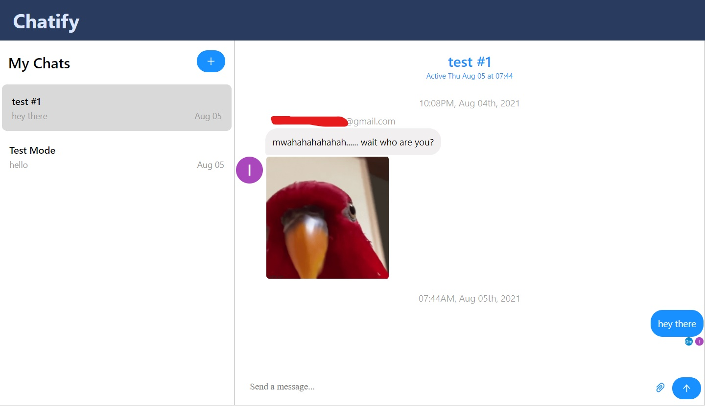

# Chatify Application

It is a full-fledged Firebase Chat Application, with social authentication including Google and Facebook using Firebase, online statuses, image support, sound notifications, the ability to create multiple rooms, and much more!

### Technology Used

 
# Environment Variables needed are
* Chat engine specifics
  * `REACT_APP_CHAT_ENGINE_ID=<value>`
  * `REACT_APP_CHAT_ENGINE_KEY=<value>`
* Firebase specifics
  * `API_KEY=<value>`
  * `AUTH_DOMAIN=<value>`
  * `PROJECT_ID=<value>`
  * `STORAGE_BUCKET=<value>`
  * `MESSAGING_SENDER_ID=<value>`
  * `APP_ID=<value>`
  * `MEASUREMENT_ID=<value>`

# Authentication Google and Facebook

# Chat Application Preview

